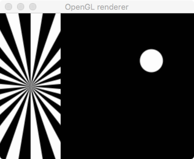

# Mixing (GStreamer command-line cheat sheet)

Page contents:

* Mixing video (i.e. replacing or overlaying)
* Mixing audio (i.e. replacing or merging audio tracks)
* Mixing video & audio together

## Mixing video

The element `compositor` allows video to be mixed (overlayed, put side-by-side, etc).

The older `videomixer` element can be used instead, and takes the same arguments as `compositor` so it's easy to swap between them. However, `videomixer` is apparently inferior in some situations, such as for live streams.

### Picture in picture

Here we have two source (mp4) files, which should be set as environment variables `$SRC` and `$SRC2`

```
gst-launch-1.0   \
    filesrc location="$SRC2" ! \
    decodebin ! videoconvert ! \
    videoscale ! video/x-raw,width=640,height=360 ! \
    compositor name=mix sink_0::alpha=1 sink_1::alpha=1 !   \
    videoconvert ! autovideosink \
    filesrc location="$SRC" ! \
    decodebin ! videoconvert ! \
    videoscale ! video/x-raw,width=320,height=180! \
    mix.
```

Put a box around the in-picture using `videobox` e.g.

```
gst-launch-1.0   \
    filesrc location="$SRC2" ! \
    decodebin ! videoconvert ! \
    videoscale ! video/x-raw,width=640,height=360 ! \
    compositor name=mix sink_0::alpha=1 sink_1::alpha=1 !   \
    videoconvert ! autovideosink \
    filesrc location="$SRC" ! \
    decodebin ! videoconvert ! \
    videoscale ! video/x-raw,width=320,height=180! \
    videobox border-alpha=0 top=-10 bottom=-10 right=-10 left=-10 ! \
    mix.
```

Choose where the in-picture goes with the ‘xpos’ and ‘ypos’ attributes of videomixer, e.g.

```
gst-launch-1.0   \
    filesrc location="$SRC2" ! \
    decodebin ! videoconvert ! \
    videoscale ! video/x-raw,width=640,height=360 ! \
    compositor name=mix sink_0::alpha=1 sink_1::alpha=1 sink_1::xpos=50 sink_1::ypos=50 !   \
    videoconvert ! autovideosink \
    filesrc location="$SRC" ! \
    decodebin ! videoconvert ! \
    videoscale ! video/x-raw,width=320,height=180! \
    mix.
```

Add audio by demuxing the inputs so it can be handled separately. This example does so on the first source (rather than mixing the two together):

```
gst-launch-1.0   \
    filesrc location="$SRC" ! \
    qtdemux name=demux  demux.audio_0 ! queue ! decodebin ! audioconvert ! audioresample ! \
    autoaudiosink \
    demux.video_0 ! queue ! \
    decodebin ! videoconvert ! \
    videoscale ! video/x-raw,width=640,height=360 ! \
    compositor name=mix sink_0::alpha=1 sink_1::alpha=1 sink_1::xpos=50 sink_1::ypos=50 !   \
    videoconvert ! autovideosink \
    filesrc location="$SRC2" ! \
    decodebin ! videoconvert ! \
    videoscale ! video/x-raw,width=320,height=180! \
    mix.
```

### Compositor with just one source

It is possible for a compositor to have just one source. This example has the test source of a bouncing ball. It also has the audio test source included (muxed).

```
gst-launch-1.0   \
    videotestsrc pattern=ball ! \
    decodebin ! \
    compositor name=mix sink_0::alpha=1 ! \
    x264enc ! muxer. \
    audiotestsrc ! avenc_ac3 ! muxer. \
    mpegtsmux name=muxer ! queue ! \
    tcpserversink host=127.0.0.1 port=7001 recover-policy=keyframe sync-method=latest-keyframe sync=false
```

## Mixing audio

Use the `audiomixer` element to mix audio. It replaces the `adder` element, which struggles under some circumstances (according to the [GStreamer 1.14 release notes](https://gstreamer.freedesktop.org/releases/1.14/)).


### Mix two (or more) test audio streams

Here we use two different frequencies (tones):

```
gst-launch-1.0 \
    audiomixer name=mix !  audioconvert ! autoaudiosink \
    audiotestsrc freq=400 ! mix. \
    audiotestsrc freq=600 ! mix.
```


### Mix two test streams, dynamically

[This Python example](python_examples/audio_dynamic_add.py) shows a dynamic equivalent of this example - the second test source is only mixed when the user presses Enter.


### Mix two (or more) MP3 files

Ensure `$AUDIO_SRC` and `$AUDIO_SRC2` environment variables are set to mp3 files.

```
gst-launch-1.0 \
    audiomixer name=mix !  audioconvert ! autoaudiosink \
    filesrc location=$AUDIO_SRC  ! mpegaudioparse ! decodebin ! mix. \
    filesrc location=$AUDIO_SRC2 ! mpegaudioparse ! decodebin ! mix.
```


### Mix a test stream with an MP3 file

Because the audio streams are from different sources, they must each be passed through `audioconvert`.

```
gst-launch-1.0 \
    audiomixer name=mix ! audioconvert ! autoaudiosink \
    audiotestsrc is-live=true freq=400 ! audioconvert ! mix. \
    filesrc location=$AUDIO_SRC ! mpegaudioparse ! decodebin ! audioconvert ! mix.
```


## Mixing video & audio together


### Mix two fake video sources and two fake audio Sources

We use `compositor` to mix the video and `audiomixer` to mix the audio.

This example combines two test video inputs and also two test audio inputs:

```
gst-launch-1.0 \
    compositor name=videomix ! autovideosink \
    audiomixer name=audiomix !  audioconvert ! autoaudiosink \
    videotestsrc pattern=ball ! videomix. \
    videotestsrc pattern=pinwheel ! videoscale ! video/x-raw,width=100 ! videomix. \
    audiotestsrc freq=400 ! audiomix. \
    audiotestsrc freq=600 ! audiomix.
```

The output looks like:



The above example is simple because we didn't have to split or combine the audio and video.
This example muxes the mixed audio & video together, and then outputs via TCP.

```
# View this in VLC with tcp://localhost:7001
gst-launch-1.0 \
    mpegtsmux name=mux ! \
    tcpserversink port=7001 host=0.0.0.0 recover-policy=keyframe sync-method=latest-keyframe sync=false \
    compositor name=videomix ! x264enc ! queue2 ! mux. \
    audiomixer name=audiomix !  audioconvert ! audioconvert ! audioresample ! avenc_ac3 ! queue2 ! mux. \
    videotestsrc pattern=ball ! videomix. \
    videotestsrc pattern=pinwheel ! videoscale ! video/x-raw,width=100 ! videomix. \
    audiotestsrc freq=400 ! audiomix. \
    audiotestsrc freq=600 ! audiomix.
```


### Mix a AV file with fake video and audio

This one puts a bouncing ball in the corner of a file:

```
gst-launch-1.0 \
    compositor name=videomix ! autovideosink \
    audiomixer name=audiomix !  audioconvert ! autoaudiosink \
    filesrc location=$SRC ! qtdemux name=demux \
    demux.video_0 ! queue2 ! decodebin ! videoconvert ! videoscale ! video/x-raw,width=640,height=360 ! videomix. \
    demux.audio_0 ! queue2 ! decodebin ! audioconvert ! audioresample ! audiomix. \
    videotestsrc pattern=ball ! videoscale ! video/x-raw,width=100,height=100 ! videomix. \
    audiotestsrc freq=400 volume=0.1 ! audiomix.
```

and this one also muxes the video and audio together to be sent over TCP:

```
# View this in VLC with tcp://localhost:7001
gst-launch-1.0 \
    mpegtsmux name=mux ! \
    tcpserversink port=7001 host=0.0.0.0 recover-policy=keyframe sync-method=latest-keyframe sync=false \
    compositor name=videomix ! x264enc ! queue2 ! mux. \
    audiomixer name=audiomix !  audioconvert ! audioconvert ! audioresample ! avenc_ac3 ! queue2 ! mux. \
    filesrc location=$SRC ! qtdemux name=demux \
    demux.video_0 ! queue2 ! decodebin ! videoconvert ! videoscale ! video/x-raw,width=640,height=360 ! videomix. \
    demux.audio_0 ! queue2 ! decodebin ! audioconvert ! audioresample ! audiomix. \
    videotestsrc pattern=ball ! videoscale ! video/x-raw,width=100,height=100 ! videomix. \
    audiotestsrc freq=400 volume=0.1 ! audiomix.
```

This one uses `uridecodebin` which allows a wider range of inputs to be added:

```
gst-launch-1.0 \
    compositor name=videomix ! autovideosink \
    audiomixer name=audiomix !  audioconvert ! autoaudiosink \
    uridecodebin uri=file://$SRC name=demux ! \
    queue2 ! audioconvert ! audioresample ! audiomix. \
    demux. ! queue2 ! decodebin ! videoconvert ! videoscale ! video/x-raw,width=640,height=360 ! videomix. \
    videotestsrc pattern=ball ! videoscale ! video/x-raw,width=100,height=100 ! videomix. \
    audiotestsrc freq=400 volume=0.1 ! audiomix.
```

And again, here's a version that muxes again to send to TCP:

```
# View this in VLC with tcp://localhost:7001
gst-launch-1.0 \
    mpegtsmux name=mux ! \
    tcpserversink port=7001 host=0.0.0.0 recover-policy=keyframe sync-method=latest-keyframe sync=false \
    compositor name=videomix ! x264enc ! queue2 ! mux. \
    audiomixer name=audiomix ! audioconvert ! audioresample ! avenc_ac3 ! queue2 ! mux. \
    uridecodebin uri=file://$SRC name=demux ! \
    queue2 ! audioconvert ! audioresample ! audiomix. \
    demux. ! queue2 ! decodebin ! videoconvert ! videoscale ! video/x-raw,width=640,height=360 ! videomix. \
    videotestsrc pattern=ball ! videoscale ! video/x-raw,width=100,height=100 ! videomix. \
    audiotestsrc freq=400 volume=0.2 ! audiomix.
```


### Mix two AV files

This does picture-in-picture, with the audio from both files included.

```
gst-launch-1.0 \
    compositor name=videomix ! autovideosink \
    audiomixer name=audiomix !  audioconvert ! autoaudiosink \
    uridecodebin uri=file://$SRC name=demux1 ! \
    queue2 ! audioconvert ! audioresample ! audiomix. \
    demux1. ! queue2 ! decodebin ! videoconvert ! videoscale ! video/x-raw,width=640,height=360 ! videomix. \
    uridecodebin uri=file://$SRC2 name=demux2 ! \
    queue2 ! audioconvert ! audioresample ! audiomix. \
    demux2. ! queue2 ! decodebin ! videoconvert ! videoscale ! video/x-raw,width=320,height=180 ! videomix.
```

## Fading
It's often nicer to fade between sources than to abruptly cut betwen them. This can be done both with video (temporarily blending using alpha channel) or audio (lowering the volume of one whilst raising it on another).

It's not possible to do this on the command line... alhough `alpha` and `volume` can be set, they can only be set to discrete values.

Programatically, however, this is possible through [dynamically controlled parameters](https://gstreamer.freedesktop.org/documentation/application-development/advanced/dparams.html). With this, you tell GStreamer the 'from' and 'to' values (e.g. 0 and 1 to increase volume), and the time period to do it.

See [`mix with fade.py`](python_examples/mix_with_fade.py) for a simple Python example.

As a slightly richer example, [`mix_with_other_props.py`](python_examples/mix_with_other_props.py) shows how other properties, such as the image's position and size, can also be changed this way.


