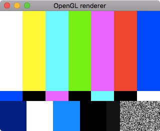
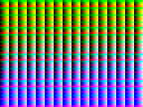

# Test streams (GStreamer command-line cheat sheet)

## Video test streams

### Display a test pattern

The `videotestsrc` element creates test patterns. Display locally like this:

```
gst-launch-1.0 videotestsrc ! videoconvert ! autovideosink
```

This should display the test pattern in a window, that looks a
bit like this:



There are multiple test patterns available, such as:

| Pattern        | Example           |
| ------------- |:-------------:|
| `videotestsrc pattern=snow`  |  |
| `videotestsrc pattern=red` (and blue, green, white and black) |  |
| `videotestsrc pattern=pinwheel` |  |
| `videotestsrc pattern=smpte100` (color test bars) |  |
| `videotestsrc pattern=colors` |  |

For the full list of patterns, see https://gstreamer.freedesktop.org/data/doc/gstreamer/head/gst-plugins-base-plugins/html/gst-plugins-base-plugins-videotestsrc.html

### Change the shape of a test pattern

To change the width and/or height, pass width and height immediately afterwards, e.g.

```
gst-launch-1.0 -v videotestsrc pattern=snow ! video/x-raw,width=1280,height=720 ! autovideosink
```

## Audio test streams

### Listen to a test audio (beep)

The element `audiotestsrc` can make a variety of test sounds:

```
gst-launch-1.0 audiotestsrc ! autoaudiosink
```

You can change the pitch using the `freq` property:

```
# This creates a higher beep:
gst-launch-1.0 audiotestsrc freq=1000 ! autoaudiosink
```

The [mixing page](./mixing.md) shows how two different frequency audio test streams can be mixed together.

You can change the *volume* by setting the `volume` property between `0` and `1`. E.g. for a quiet beep:

```
gst-launch-1.0 audiotestsrc volume=0.1 ! autoaudiosink
```

### White noise

Set `wave` to `white-noise`:

```
gst-launch-1.0 audiotestsrc wave="white-noise" ! autoaudiosink
```

There are variations (e.g. _red noise_) - see the [docs](https://gstreamer.freedesktop.org/data/doc/gstreamer/head/gst-plugins-base-plugins/html/gst-plugins-base-plugins-audiotestsrc.html) for a complete list.

### Silence

If you need an audio stream with nothing in:

```
gst-launch-1.0 audiotestsrc wave="silence" ! autoaudiosink
```

## Combining audio and video test streams

Combine both the test pattern and test audio:

```
gst-launch-1.0 audiotestsrc ! autoaudiosink videotestsrc ! autovideosink
```
